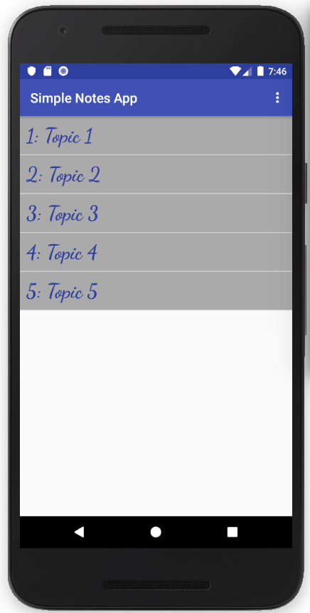
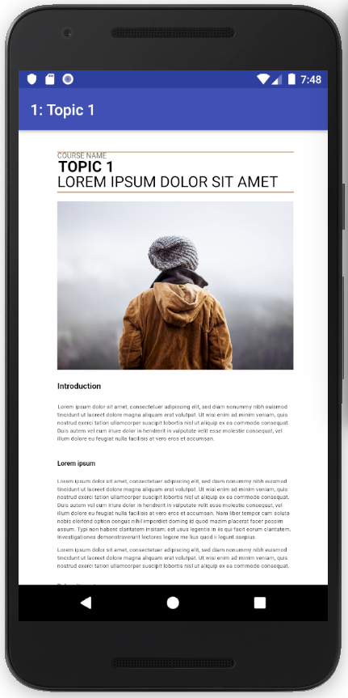
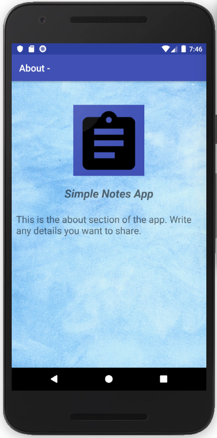

# Template for Android App for a Website
 
## Already Deployed Apps using this Template :
### **Strength of Materials - Notes** - (50,000+ Downloads)

<a href="https://play.google.com/store/apps/details?id=com.saranshtiwari.strengthofmaterials_notes"></a><br>

### **Mechanics and Thermodynamics** - (5,000+ Downloads)

<a href="https://play.google.com/store/apps/details?id=com.saranshtiwari.mechanicsthermo"></a><br>

## Features
* Zoomable View
* Source Notes Files not Visible

## To use source code : 
1. Clone Repository <br>
```git clone https://github.com/ft-abhishekgupta/android-notes-app```
1. Open Repository in Android Studio
1. Sync Project and Install Required Dependencies
1. Build and Run Project.

## Modify App for your own website 
1. Modify values in ```strings.xml``` file with your own values.
1. Generate Icons at https://romannurik.github.io/AndroidAssetStudio/icons-launcher.html and paste them in **res** folder
1. Also replace images in **res/drawable** folder 
1. Save your notes as html files in **res/asset** folder
1. Change String list in **MainActivity.java** to represent topic names
1. Add file names in **Content.java** file
1. Build and run. ```Your App is Ready```

## Screenshots



